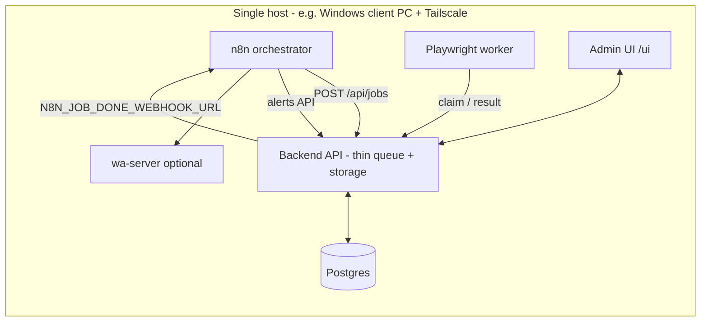

# Amazon Scraper Platform (v2)

A cheap, fast, dynamic, self-hostable platform for monitoring Amazon PDPs and SERPs
across multiple niches and sellers. Rebuilt around **n8n as orchestrator**, a
**stateless Playwright worker**, a **thin FastAPI backend + Postgres** store, and a
**custom admin UI** with a group builder and readable dashboards.

> Standalone repo. Vendors `wa-server` so the entire stack (including WhatsApp delivery)
> deploys from a single repository — ideal for Coolify / one-command Docker hosting.

## Architecture (n8n-centric)



- **n8n** is the orchestrator: schedules scrapes, reads group config from **Data Tables**,
  processes job results (diff, filters, alerts), and delivers WhatsApp messages.
- **Backend** is a thin layer: DB-backed job queue (`FOR UPDATE SKIP LOCKED`), product state,
  alerts, metrics, and admin UI. Fires a webhook to n8n when each job completes.
- **Worker** is stateless and **pull-based** — ideal on a client PC with a residential IP
  (no inbound ports, no proxy), or in Docker with `PROXY_URL`.
- **Selectors and browser profiles are data**: edit in n8n Data Tables (no deploy needed).

**Windows client deployment (recommended for residential IP):** [deploy/WINDOWS_CLIENT_SETUP.md](deploy/WINDOWS_CLIENT_SETUP.md)

## Key concepts

- **Group**: a `pdp` or `serp` monitor with its own interval, selector profile, and
  **filters** (accepted sellers, keywords, price bounds, shipping rules, alert toggles).
  Configure in **n8n Data Tables**.
- **Targets**: ASINs (for `pdp` groups) or search URLs (for `serp` groups).
- **Alerts**: `new_product`, `back_in_stock`, `price_drop` (per-group thresholds),
  delivered via n8n -> WhatsApp.

## Repository layout

| Path | What |
|------|------|
| `backend/` | FastAPI app, Postgres migrations, selector seed, Dockerfile |
| `worker/` | Stateless Playwright scraper (selector-driven), Dockerfile |
| `admin-ui/` | Vanilla JS admin UI (served by the backend at `/ui/`) |
| `n8n/` | Orchestration workflows, Data Tables schema, setup notes |
| `wa-server/` | Vendored WhatsApp delivery bridge (Express + whatsapp-web.js) |
| `deploy/` | `docker-compose.yml`, `.env.example`, runbook (incl. Coolify) |

## Get started

| Scenario | Guide |
|----------|-------|
| **Windows client PC** (full stack, residential IP) | [deploy/WINDOWS_CLIENT_SETUP.md](deploy/WINDOWS_CLIENT_SETUP.md) |
| Docker quickstart / Coolify / Linux | [deploy/README.md](deploy/README.md) |

```bash
cd deploy && cp .env.example .env && docker compose up -d --build
# Admin UI: http://localhost:8000/ui/
# Then: import n8n workflows, create Data Tables, set N8N_JOB_DONE_WEBHOOK_URL
```

## Observability

- **Logs**: structured JSON, one event per line (`ts`, `level`, `component`, plus
  `run_id`/`group_id`/`job_id` context) across backend and worker.
- **Metrics**: per-run rows in `run_metric` (duration, bytes, ok/skip, captcha, alerts),
  surfaced as charts + a recent-runs table on the dashboard.
