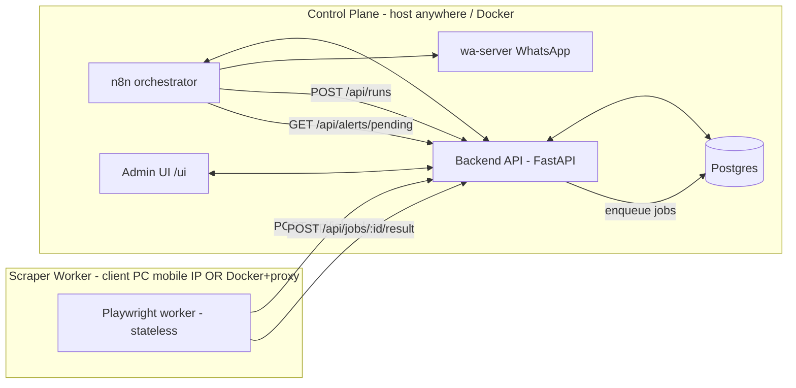

# Amazon Scraper Platform (v2)

A cheap, fast, dynamic, self-hostable platform for monitoring Amazon PDPs and SERPs
across multiple niches and sellers. Rebuilt around **n8n as orchestrator**, a
**stateless Playwright worker**, a **FastAPI backend + Postgres** brain, and a
**custom admin UI** with a group builder and readable dashboards.

> Standalone repo. Vendors `wa-server` so the entire stack (including WhatsApp delivery)
> deploys from a single repository — ideal for Coolify / one-command Docker hosting.

## Architecture



- **n8n** schedules runs (short/long cadence) and delivers alerts. No business logic.
- **Backend** owns config, the DB-backed job queue (`FOR UPDATE SKIP LOCKED`), and the
  generalized diff/alert/filter engine. Serves the admin UI at `/ui/`.
- **Worker** is stateless and **pull-based**, so it can run on a client PC behind NAT
  (for mobile IP) with no inbound networking, or in Docker with a `PROXY_URL`.
- **Selectors are data**: versioned selector profiles in the DB, editable in the UI,
  overridable via `SELECTOR_PROFILE_JSON` env for emergency hotfixes.

## Key concepts

- **Group**: a `pdp` or `serp` monitor with its own cadence, selector profile, and
  **filters** (accepted sellers, required/blacklist keywords, price bounds, shipping
  rules, alert toggles). Build groups visually in the admin UI.
- **Targets**: ASINs (for `pdp` groups) or search URLs (for `serp` groups).
- **Alerts**: `new_product`, `back_in_stock`, `price_drop` (per-group thresholds),
  delivered via n8n -> WhatsApp.

## Repository layout

| Path | What |
|------|------|
| `backend/` | FastAPI app, Postgres migrations, selector seed, Dockerfile |
| `worker/` | Stateless Playwright scraper (selector-driven), Dockerfile |
| `admin-ui/` | Vanilla JS admin UI (served by the backend at `/ui/`) |
| `n8n/` | Importable orchestration workflows + notes |
| `wa-server/` | Vendored WhatsApp delivery bridge (Express + whatsapp-web.js) |
| `deploy/` | `docker-compose.yml`, `.env.example`, runbook (incl. Coolify) |

## Get started

See **[deploy/README.md](deploy/README.md)** for the one-command Docker quickstart,
n8n setup, WhatsApp wiring, and the mobile-IP worker option.

```bash
cd deploy && cp .env.example .env && docker compose up -d --build
# Admin UI: http://localhost:8000/ui/
```

## Observability

- **Logs**: structured JSON, one event per line (`ts`, `level`, `component`, plus
  `run_id`/`group_id`/`job_id` context) across backend and worker.
- **Metrics**: per-run rows in `run_metric` (duration, bytes, ok/skip, captcha, alerts),
  surfaced as charts + a recent-runs table on the dashboard.
