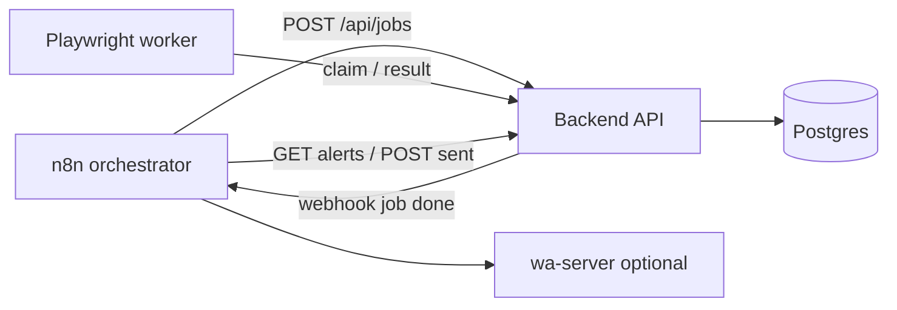

# Deployment & Runbook

Docker Compose stack for the **n8n-centric** Amazon Scraper Platform.

**Windows client PC (full stack on one machine):** see **[WINDOWS_CLIENT_SETUP.md](WINDOWS_CLIENT_SETUP.md)** — Tailscale, Docker Desktop, n8n Data Tables, and residential-IP worker.

## Architecture (n8n-centric)



- **n8n** owns scheduling, diff/filter logic, and alert delivery. Config lives in n8n **Data Tables** (see [n8n/data-tables/README.md](../n8n/data-tables/README.md)).
- **Backend** is a thin queue + storage API: jobs, state, alerts, metrics. Fires `N8N_JOB_DONE_WEBHOOK_URL` when a job completes.
- **Worker** is stateless and pull-based (`POST /api/jobs/claim`).
- **Admin UI** at `/ui/` remains available for dashboards, selector profiles, and optional group management.

## Services

| Service     | Port | Role |
|-------------|------|------|
| `postgres`  | 5432 | Config, state, history, jobs, metrics (+ n8n DB) |
| `backend`   | 8000 | FastAPI queue/storage, admin UI at `/ui/` |
| `worker`    | —    | Stateless Playwright scraper |
| `n8n`       | 5678 | Orchestrator: schedules jobs, processes results, delivers alerts |
| `wa-server` | 3001 | Optional (`--profile whatsapp`) WhatsApp bridge |

## Quickstart

```bash
cd deploy
cp .env.example .env          # edit API_TOKEN, ADMIN_PASSWORD, POSTGRES_PASSWORD, ...
docker compose up -d --build
```

Then open:

- Admin UI: http://localhost:8000/ui/ (`ADMIN_USER` / `ADMIN_PASSWORD`)
- n8n editor: http://localhost:5678/ (same Basic auth)
- API health: http://localhost:8000/health

## Wire up n8n (one time)

1. Import workflows from `n8n/workflows/` (see [n8n/README.md](../n8n/README.md)).
2. Create **Data Tables** per [n8n/data-tables/README.md](../n8n/data-tables/README.md).
3. Copy the job-processor **Webhook** production URL into `.env` as `N8N_JOB_DONE_WEBHOOK_URL`, then `docker compose up -d backend`.
4. **Activate** scheduler, job-processor, and `notifier.json` workflows.

> **Do not activate** `orchestrator_short.json` / `orchestrator_long.json` — they call the removed `POST /api/runs` endpoint. Use the n8n-centric scheduler workflows that enqueue via `POST /api/jobs`.

## WhatsApp delivery

Two options:

- **Host wa-server** (recommended on Windows): run on port 3001, set `WA_API_URL=http://host.docker.internal:3001`. See [WINDOWS_CLIENT_SETUP.md](WINDOWS_CLIENT_SETUP.md#6-whatsapp-wa-server-on-windows).
- **Docker profile**: `docker compose --profile whatsapp up -d --build wa-server`, scan QR from logs. Session persists in `wadata` volume.

Set `WA_API_KEY` and `WA_GROUP_ID` in `.env`. Per-group `notify_channel` in Data Tables overrides `WA_GROUP_ID`.

## Production: residential / mobile IP

Amazon blocks datacenter IPs. On a **client PC with a home/mobile connection**, run the full stack including the Docker worker with `PROXY_URL` empty — the worker uses the host's outbound IP.

To split control plane (cloud) and scraper (client PC):

```bash
# on server: disable docker worker
docker compose up -d --scale worker=0
# on client PC: point worker at server BACKEND_URL + API_TOKEN (see worker/README.md)
```

Or set `PROXY_URL` to a residential proxy and keep the docker worker on a VPS.

## Selector hotfix

- Edit **Selector Profiles** in the Admin UI (worker receives selectors with each job), or
- Set `SELECTOR_PROFILE_JSON` in `.env` and `docker compose up -d backend`.

## Operations

```bash
docker compose logs -f backend worker n8n
docker compose up -d --scale worker=3
docker compose down          # stop, keep volumes
docker compose down -v       # DANGER: wipe all data
```

## Coolify / Linux VPS

Coolify on a datacenter IP is fine for validating the control plane (n8n → queue → webhooks → dashboards), not scrape quality.

1. Docker Compose resource: compose file `deploy/docker-compose.yml`, base directory repo root.
2. Set `API_TOKEN`, `ADMIN_USER`, `ADMIN_PASSWORD`, `POSTGRES_PASSWORD`; optional `SEED_DEMO_GROUP=true`.
3. Expose ports 8000 (backend) and 5678 (n8n).
4. Import workflows, create Data Tables, set `N8N_JOB_DONE_WEBHOOK_URL`, activate workflows.
5. Run the worker on a mobile-IP machine or use `PROXY_URL`.

## Troubleshooting

| Symptom | Check |
|---------|--------|
| **401** | `API_TOKEN` (machine) or Basic auth (UI/n8n) |
| **No jobs** | Data Tables: enabled group + targets; scheduler workflow **Active** |
| **No webhook** | `N8N_JOB_DONE_WEBHOOK_URL`, backend restarted; URL uses `http://n8n:5678/...` inside Docker |
| **Captcha** | Datacenter IP — use client-PC worker or proxy |
| **wa-server unreachable** | `WA_API_URL`, `host.docker.internal` on Windows |

Full Windows walkthrough: **[WINDOWS_CLIENT_SETUP.md](WINDOWS_CLIENT_SETUP.md)**.
